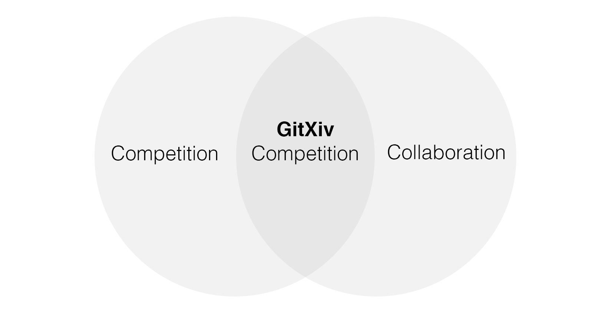

## [GitXiv](http://gitxiv.com) Competition: Deep Q&A
 
**Name**: Deep Q&A Neural Conversation Model (Google) 
**Paper**: http://arxiv.org/abs/1506.05869 
**Goal**: Replicate the findings of the Deep Q&A research paper, preferably in collaboration with others. Use library of choice. Upload your findings here on GitHub. 
**Price**: <i>something special</i> and you will be the first one to make it to <i>GitXiv's Hall of Fame</i> 
**Getting Started**: check the [wiki](https://github.com/GitXiv/DeepQA/wiki/Getting-started-with-DeepQA)  

While this is a competition, GitXiv incentive collaboration: the person or team of persons who contributes the most to the final working implementation wins! This means that it might be awesome if someone fixes the final bug of an implementation in one line (ie a typo), but the person(s) spending weeks on coding things up might make a better chance of getting added to GitXiv's Hall of Fame. Or if someone has written an extremely detailed and useful blog post on the matter and added it here, he or she might be the grand final winner instead, who knows :) 
 
**So if its all about who contributes the most, who decides on that, you?** 
Excellent question! No in the end we will find a way to decide together, by voting, or by an open hangout discussion, or whatever... 
 
Good luck!
